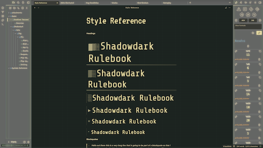

# Nostromo Theme

An 80's retro-futuristic Obsidian theme. Experience Obsidian as if you're working on an aging starship's terminal screen.

## Features

- **VT323 monospace font** for that authentic terminal feel
- **Amber/green terminal color scheme** with scanline effects
- **Glowing text and subtle animations** for immersive experience
- **Weathered, industrial interface elements**
- **Perfect for space-age note-taking** without the eye strain
- **Cassette-futurism styled scrollbars** with retro aesthetics
- **Terminal status indicator** in bottom-left corner
- **Cyberpunk-inspired typography** with heading prefixes
- **Retro-futuristic horizontal rules** with multiple styles
- **CRT monitor effects** including scanlines and subtle screen flicker

## Installation

### From Obsidian Community Themes

1. Open Obsidian Settings
2. Go to **Appearance** → **Themes**
3. Click **Browse community themes**
4. Search for "Nostromo"
5. Click **Install and use**

### Manual Installation

1. Download the latest release from [GitHub](https://github.com/gvorbeck/obsidian-retro-futuristic-theme)
2. Extract the files to your vault's `.obsidian/themes/Nostromo/` folder
3. Go to **Settings** → **Appearance** → **Themes**
4. Select "Nostromo" from the dropdown

## Theme Details

### Color Palette

The theme uses a carefully crafted color palette inspired by vintage computer terminals:

- **Yellow**: `#e8d8a3` - Primary accent color
- **Blue**: `#6b8ca4` - Secondary elements
- **Green**: `#7a8f71` - Terminal indicators and success states
- **Orange**: `#c28c5c` - Warnings and highlights
- **Red**: `#b06c5a` - Errors and important elements
- **Purple**: `#9c7a99` - Special content types
- **Gray**: `#a8a8a8` - Muted elements

### Typography

- **Primary Font**: VT323 (imported from Google Fonts)
- **Interface Font**: Share Tech Mono
- **Text Font**: System default for readability

### Special Elements

#### Terminal Status Indicator

A persistent status bar appears in the bottom-left corner displaying:

- System status
- Recording indicator
- Terminal version information

#### Heading Styles

Each heading level has unique cyberpunk-style prefixes:

- H1: `▓▒░`
- H2: `▒░`
- H3: `░`
- H4: `▸`
- H5: `◦`
- H6: `·`

#### Horizontal Rules

Multiple horizontal rule styles available:

- Default cyberpunk divider with gradient effects
- `.minimal-hr` - Subtle dotted style
- `.tech-hr` - System break indicator
- `.grid-hr` - Data stream with grid pattern
- `.scan-hr` - Animated scanning line
- `.terminal-hr` - Classic terminal divider

## Compatibility

- **Minimum Obsidian Version**: 1.6.0
- **Supported Modes**: Dark mode only
- **Platform**: All platforms (Windows, macOS, Linux, Mobile)

## Contributing

Contributions are welcome! Please feel free to submit issues and pull requests.

### Development Setup

1. Clone the repository
2. Make changes to `theme.css`
3. Test in Obsidian by placing files in `.obsidian/themes/Nostromo/`
4. Submit a pull request

### Reporting Issues

Please include the following when reporting issues:

- Obsidian version
- Operating system
- Steps to reproduce
- Screenshots if applicable

## Changelog

### v1.0.0

- Initial release
- Retro-futuristic design with CRT effects
- Terminal-inspired typography
- Cassette-futurism styled scrollbars
- Multiple horizontal rule styles
- Cyberpunk heading prefixes

## License

This theme is released under the MIT License. See [LICENSE](LICENSE) file for details.

## Credits

- Uses VT323 and Share Tech Mono fonts from Google Fonts
- Created by [@gvorbeck](https://github.com/gvorbeck)

## Support

If you enjoy this theme, consider:

- ⭐ Starring the repository
- 🐛 Reporting issues
- 💡 Suggesting improvements

---

_"In space, no one can hear you take notes."_
